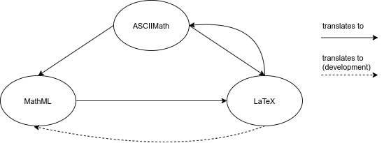

    

py_asciimath is a simple yet powerful Python module that:

* converts an ASCIIMath string to LaTeX or MathML
* converts a MathML string to LaTeX (the conversion is done thank to the [XSLT MathML Library](https://sourceforge.net/projects/xsltml/). Please report any unexpected behavior)
* exposes a single translation method `translate(exp, **kwargs)`, which semantic depends on the py_asciimath translator one wish to use
* exposes a MathML parser

  

